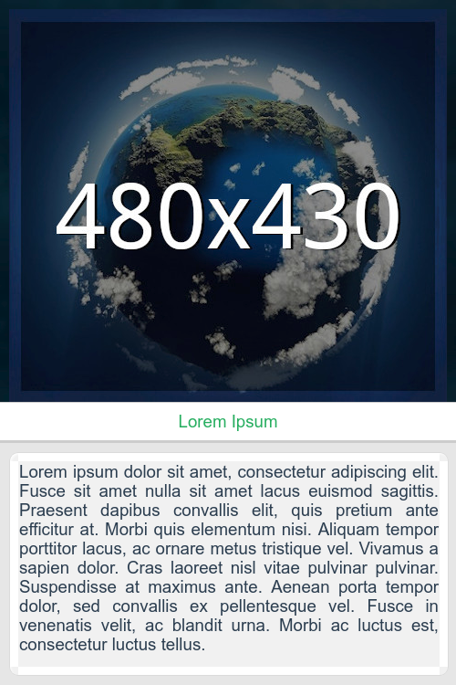

# Sobre
**post-template-generator** é um gerador de template para publicação de postagens em mídias sociais, como Instagram, Facebook e Telegram. [Dispoível aqui](https://autociencia.github.io/post-template-generator/).

    

# Para compilar
Use `npm install` para instalar as dependências e `grunt` para transpilar os arquivos. Para iniciar o lite-server, use `npm start`, mas não esqueça de editar o index.html e alterar `/post-template-generator/js` para `/js` apenas.

# Como usar

1. Dê um título a sua publicação
2. Coloque uma descrição
3. Escolha uma imagem de seu computador, como ilustração do post

Obs.: a imagem pode ser PNG ou JPG, mas precisa ter as seguintes dimensões:
* 480px de largura
* 430px de altura

O projeto foi desenvolvido em TypeScript e está sob a licença Apache 2.0. O [@Autociência](https://github.com/autociencia) **NÃO** se responsabiliza pelo uso indevido da ferramenta por terceiros.
